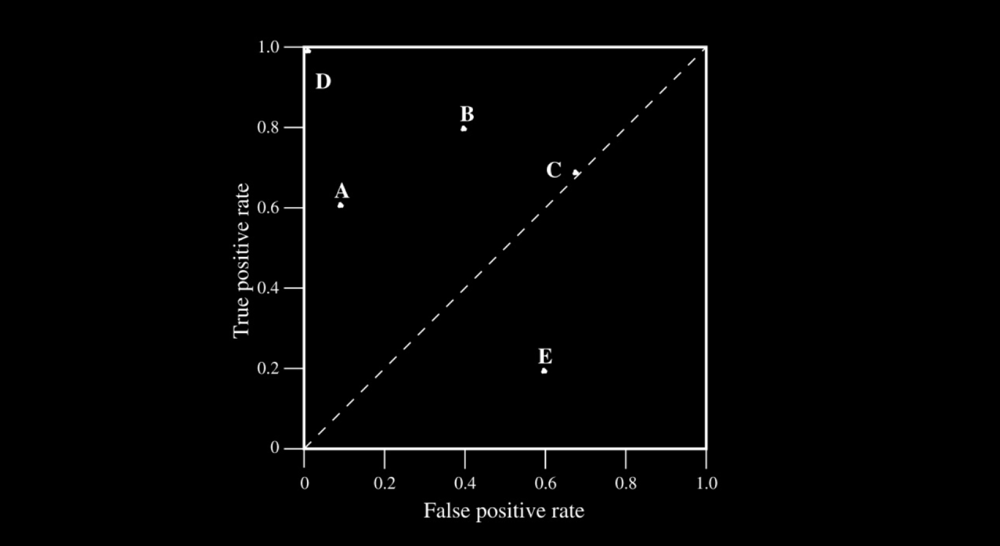

# 机器学习八股文

## Machine Leaning

### ML 基础概念

1. Overfitting / Underfitting  

   **过拟合**指模型与数据的匹配程度过高，将训练数据一些正常的起伏、波动、异常值也当作是数据的特征，导致模型对新数据的泛化能力变差。具体的表现为在训练集上表现非常优秀，而在验证集/测试集中表现非常差。
    - 解决过拟合的方法一般有：1) 适量减少特征的数量；2) 添加**正则化项**(Regularization)。正则化，顾名思义，目的是为了降低特征对于预测结果的影响能力。常见的正则化项有L1正则项和L2正则项。详见正则化。
    
    **欠拟合**与过拟合相反，指的是模型缺乏足够的泛化能力。
    - 解决欠拟合的方法有：1) 增加训练轮数；2) 增加模型特征；3) 减少正则项。

2. Bias / Variance trade-off

    偏差(Bias)指模型预测结果与真实值的差异程度，描述了模型的拟合能力；方差(Varience)指模型面对不同数据集时的差异程度，描述了数据扰动对模型的影响。
    一般来说，越简单模型的偏差越高，方差越低；越复杂模型的偏差越低，方差越高。这同样也对应着模型的过拟合与欠拟合。

    权衡偏差与方差的常见方法有**交叉认证**(Cross-Validation)。K折交叉验证的基本方法为：将训练集平均分为$k$份，每次训练取其中一份作为验证集，剩下$k-1$份作为训练集，重复$k$次，直到每一份小数据集都被作为过验证集。最终的损失为$k$次训练的损失取平均。

### 正则化 Regularization

1. L1 vs L2

    - L1正则化，又称LASSO、L1范数，是所有参数的绝对值之和。
        $$
            \lVert x \lVert_1=\sum_{i=1}^m\lvert x_i \lvert
        $$
    
    - L2正则化，又称Ridge，岭回归，是所有参数的平方和的平方根。

        $$
            \lVert x \lVert_2=\sqrt{\sum_{i=1}^m x_i^2}
        $$

    - 两种范数都有助于降低过拟合风险。L1范数可以用于**特征选择**，但不能直接求导，因此不能使用常规的梯度下降法/牛顿法等进行优化（常见方法有坐标轴下降法和 Lasso 回归法）；L2范数方便求导。

2. L1范数的稀疏性 / 为何L1正则化可以用于特征选择？

    L1范数相比于L2范数，更容易得到**稀疏解**，即L1范数可以将不重要的特征参数优化至**0**.

    - 如何理解？
    > 假设损失函数 $L$ 与某个参数 $x$ 的关系如下图所示：此时最优点位于绿色点处，$x<0$.
    > 
    > 
    >
    > 这时施加 L2 正则化，新的损失函数 $(L+Cx^2)$ 如下图蓝线所示，可以看到最优的 $x$ 在黄点处，$x$ 的绝对值减小了，但依然非零。
    >
    > 
    >
    > 而如果施加 L1 正则化，则新的损失函数 $(L+C\lvert x \lvert)$ 如下图粉线所示，最优的 $x$ 就变成了 0。
    >
    > 
    >
    > 略加推导可以得到，当施加 L2 正则化时，当且仅当损失函数原本的导数为 0 时，损失函数才会在 $x=0$ 处极小；而施加 L1 正则化时，参数 $C$ 与损失函数的导数仅需满足 $C>\lvert L \lvert$ 的关系，$x=0$ 便会成为损失函数的一个极小值点。 
    >
    > 上面只分析了一个参数 $x$。事实上 L1 正则化会使得许多参数的最优值变成 0，使得模型变得稀疏。利用这样的特性，我们便可以使用L1正则化来帮助筛选特征。

### 机器学习中的评估指标 Metrics

1. Precision / Recall / $F_1$ Score

    对于二分类问题，我们常常使用精确率(Precision)、召回率(Recall)以及$F_1$ Score来评估二分类模型的性能。对于一个二分类器，在数据集上的预测情况可以分为以下4种：

    - TP(True Positive)，将正类**正确**预测为正类；
    - TN(True Negative)，将负类**正确**预测为负类；
    - FP(False Positive)，将负类**错误**预测为正类；
    - FN(False Negative)，将正类**错误**预测为负类；
    
    有了以上概念，我们可以给出以下评估指标的定义：

    - 精确率定义为：
        $$
            P=\frac{TP}{TP+FP}
        $$
        即在模型**预测为正类**的样本中，预测正确的比例。可以看到，精确率更加关注于模型认为是正类样本的结果。
    - 召回率定义为：
        $$
            R=\frac{TP}{TP+FN}
        $$
        即在正类的样本中，模型预测正确的比例。相比之下，召回率更加关注于那些**真实值为正类**的样本。
    - 此外，$F_1$ 值定义为精确率与召回率的调和均值，即
        $$
            \frac{2}{F_1}=\frac{1}{P}+\frac{1}{R}
        $$
        $$
            F_1 = \frac{2 \times P \times R}{P + R} = \frac{2TP}{2TP+FP+FN}
        $$
        当精确率和召回率都高时，$F_1$ 值也会高。

2. 混淆矩阵 Confusion Matrix

    分类结果的混淆矩阵如下表所示。
    

3. macro-$F_1$ vs micro-$F_1$

    很多时候我们有多个二分类混淆矩阵（例如多次训练与测试 / 多个数据集 / 多分类任务中每两两类别的组合等），这是我们希望在 $n$ 个二分类混淆矩阵上综合考察模型性能。

    - macro-$F_1$

        一种直接的做法是直接计算各个混淆矩阵的精确率和召回率，再计算平均值，分别得到 macro-$P$、macro-$R$和对应的macro-$F_1$. 
        $$
            \text{macro-}P = \frac{1}{n}\sum_{i=1}^n P_i, \qquad
            \text{macro-}R = \frac{1}{n}\sum_{i=1}^n R_i,
        $$
        $$
            \text{macro-}F_1 = \frac{2 \times \text{macro-}P \times \text{macro-}R}{\text{macro-}P + \text{macro-}R}
        $$
    
    - micro-$F_1$

        另一种做法是先将各个混淆矩阵的对应元素进行平均，得到$\overline{TP}$、$\overline{TN}$、$\overline{FP}$和$\overline{FN}$，再基于这些值计算出micro-$P$、micro-$R$和对应的micro-$F_1$. 
        $$
            \text{micro-}P = \frac{\overline{TP}}{\overline{TP}+\overline{FP}}, \qquad
            \text{micro-}R = \frac{\overline{TP}}{\overline{TP}+\overline{FN}},
        $$
        $$
            \text{micro-}F_1 = \frac{2 \times \text{micro-}P \times \text{micro-}R}{\text{micro-}P + \text{micro-}R}
        $$

4. ROC 曲线 / AUC 面积

    ROC 曲线(Receiver Operating Characteristic)与 AUC (Area Under ROC Curve)是面对**不平衡分类问题**时最常用的评估指标。要了解 ROC 是什么，首先我们根据混淆矩阵再定义两个指标：True Positive Rate(TPR) 以及 False Positive Rate(FPR). 

    $$
        TPR = R = \frac{TP}{TP+FN}, \qquad
        FPR = \frac{FP}{TN+FP},
    $$
    正常来说，一个好的模型应该满足高 TPR 和低 FPR。对于任意一个训练好的模型，在给定测试数据上我们都能计算出它的 TPR 和 FPR。以 FPR 为横坐标，TPR 为纵坐标，我们可以将任意模型的一对 (FPR, TPR) 画在该坐标图中，如下图所示。同时我们将由该坐标轴构成的空间称为 ROC 空间。图1中假设有 A、B、C、D、E 共计五个模型。在 ROC 空间中，模型越靠近左上角，表明模型效果越好。
    

    在二分类问题的大多数情况中（尤其是神经网络中），我们判定一个样本是正类和负类的依据是设置一个阈值，超过该阈值的样本被标记为正类，反之则为负类。一般而言，这个阈值被设置为0.5。那么如果我们尝试使用不同的阈值来划分正负类，我们就能得到多组 (FPR, TPR)。我们可以根据这些坐标近似地在 ROC 空间中画出一条曲线，即 **ROC 曲线**。只要 (FPR, TPR) 点足够多，我们可以计算出曲线下的面积，即 **AUC面积**，如下图所示。
    

### Loss与优化

1. 凸优化问题

    对于一个优化问题，如果其目标函数是**凸函数**，且可行域是**凸集**（集合中任意两点连线上的任意点都在集合内），那么它就是一个凸优化问题。
    
    定义域 $\mathbb{D}$ 是一个凸集的函数 $f$ 是凸函数，当且仅当对于任意的 $x,y \in \mathbb{D}$ 和 $\theta \in [0,1]$，都有：

    $$
        f(\theta x+(1-\theta)y) \le \theta f(x)+(1-\theta) f(y)
    $$

    

    数学中强调凸优化问题的重要性，在于凸优化问题的**局部最优解**必然也是其**全局最优解**。这个特性使得我们可以使用贪心算法、梯度下降法、牛顿法等方法来求解凸优化问题。事实上，我们求解许多非凸优化问题，也是通过将其拆解为若干个凸优化问题，再分别进行求解。

2. MSE / MSELoss

    均方误差 (Mean Square Error, MSE)，是回归任务中最常见的度量指标。

    $$
        E(f;D)=\sum_{i=1}^m (f(x_i) - y_i)^2
    $$

3. 以 MSELoss 为损失函数的逻辑回归是凸优化问题吗？

    **不是**。逻辑回归将线性模型通过 sigmoid 非线性函数映射为分类问题，其 MSE 是一个非凸函数，优化时可能得到局部最优解而得不到全局最优解，所以以 MSELoss 为损失函数的逻辑回归不是凸优化问题。

4. 线性回归，最小二乘法与最大似然估计的关系？

    求解线性回归常用的方法有**最小二乘法 (OLS)**和**最大似然估计 (MLE)**。

    - 最小二乘法以预测值和真实值的平方和作为损失函数 (MSELoss)。

        $$
            J(w)=\sum_{i=1}^m (h_w(x_i) - y_i)^2
        $$

    - 最大似然估计在已知 $x$ 与 $y$ 的情况下，以**概率最大**的角度，估计模型可能性最大的参数 $h_w$。设误差 $\epsilon_i = y_i - h_w(x_i)$， 由于 $\epsilon_i$ 符合高斯分布，可得概率密度函数：
        
        $$
            p(\epsilon_i) = \frac{1}{\sigma \sqrt{2\pi}} e^{-\frac{(\epsilon_i)^2}{2\sigma^2}}
        $$

        将 $\epsilon_i = y_i - h_w(x_i)$ 代入，可得：

        $$
            p(y_i | h_w(x_i)) = \frac{1}{\sigma \sqrt{2\pi}} e^{-\frac{(y_i - h_w(x_i))^2}{2\sigma^2}}
        $$

        则似然函数公式如下：

        $$
            \begin{aligned}
                L(h_w(x_i)) &= \prod_{i=1}^m p(y_i | h_w(x_i))\\
                &= \prod_{i=1}^m \frac{1}{\sigma \sqrt{2\pi}} e^{-\frac{(y_i - h_w(x_i))^2}{2\sigma^2}} \\
            \end{aligned}

        $$

        等号两边取对数，不影响函数的极值点。

        $$
            \begin{aligned}
                \log L(h_w(x_i)) &= \sum_{i=1}^m \log \frac{1}{\sigma \sqrt{2\pi}} e^{-\frac{(y_i - h_w(x_i))^2}{2\sigma^2}}\\
                &= m \log \frac{1}{\sigma \sqrt{2\pi}} - \frac{1}{2\sigma^2} \sum_{i=1}^m (y_i - h_w(x_i))^2
            \end{aligned}
        $$

        我们知道 $h_w(x)$ 是关于权重 $w$ 的函数，不妨设为 $l(w)$。因此有：
            
        $$
            \begin{aligned}
                l(w) = m \log \frac{1}{\sigma \sqrt{2\pi}} - \frac{1}{2\sigma^2} \sum_{i=1}^m (y_i - h_w(x_i))^2
            \end{aligned}
        $$

        去除前面的常数项和常数系数，可以看到与最小二乘法的的公式一致，之后求解过程同最小二乘法。因此得出结论，最小二乘法与最大似然估计从两个不同的角度出发，得到一致的结果。

5. 相对熵与交叉熵 Ralative-Entropy / Cross-Entropy

    我们常用**信息量**来量化数据中的信息。设事件 $x_0$ 发生的概率为 $p(x_0)$，则其信息量为：

    $$
        I(x_0) = -\log p(x_0)
    $$

    **熵** (Entropy) 被用来度量一个系统的混乱程度，代表一个系统中所有事件信息量的期望。熵越大，该系统的不确定性也越大。

    $$
        H(X) = -\sum_{x \in X}p(x_i) \log p(x_i)
    $$

    **相对熵** (Ralative Entropy)，又称 **KL 散度** (Kullback-Leibler Divergence)，是两个随机分布 $p$ 与 $q$ 之间的对数差值的期望。

    $$
        D_{KL}(p||q)=\sum_{x\in X} p(x)\log\frac{p(x)}{q(x)}=-\sum_{x\in X} p(x)[\log q(x) - \log p(x)]
    $$

    **交叉熵** (Cross-Entropy)，与 KL 散度类似，是两个随机分布 $p$ 与 $q$ 之间距离的另一种度量。

    $$
        CEH(p,q)=−\sum_{x \in X}p(x)logq(x)
    $$

    > **为何在机器学习中常使用交叉熵而不是 KL 散度作为损失函数？**
    >
    > 可以看到，相对熵、交叉熵之间存在以下关系：
    > 
    >    $$
    >       D_{KL}(p||q) = CEH(p,q) - H(p)
    >    $$
    >    
    > 在机器学习中，可以将 $p$ 看作真实分布，$q$ 为预测分布。则当 $p$ 的分布已知时，$H(p)$ 为常数，交叉熵与 KL 散度等价。

