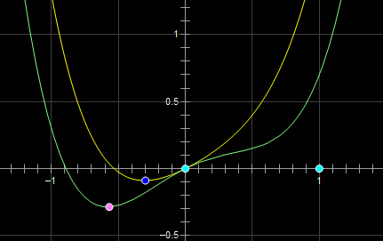
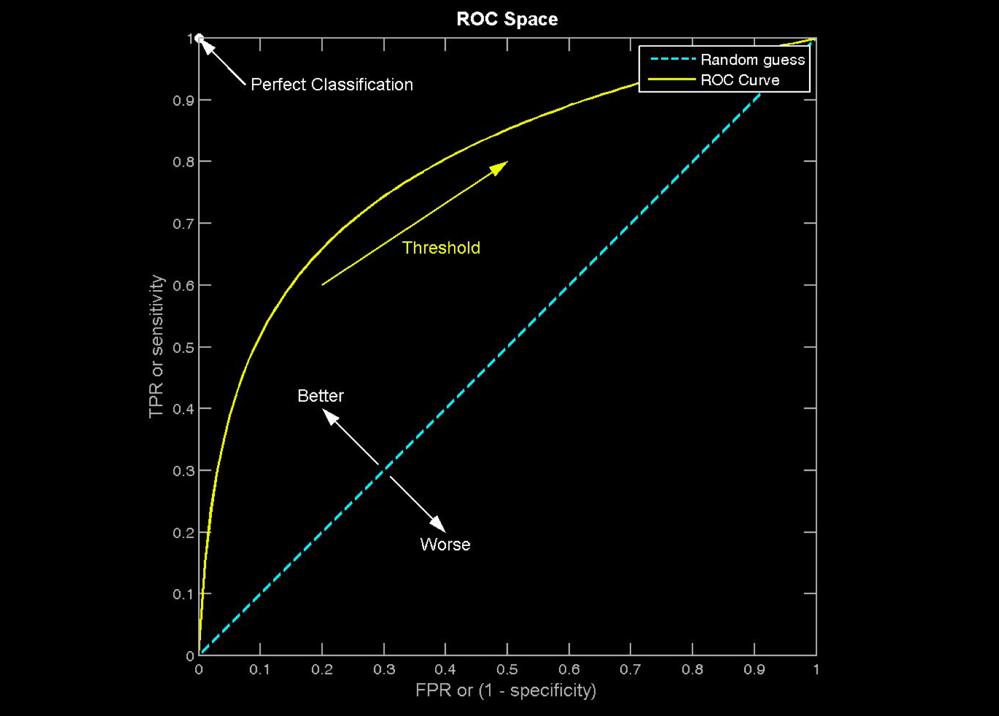
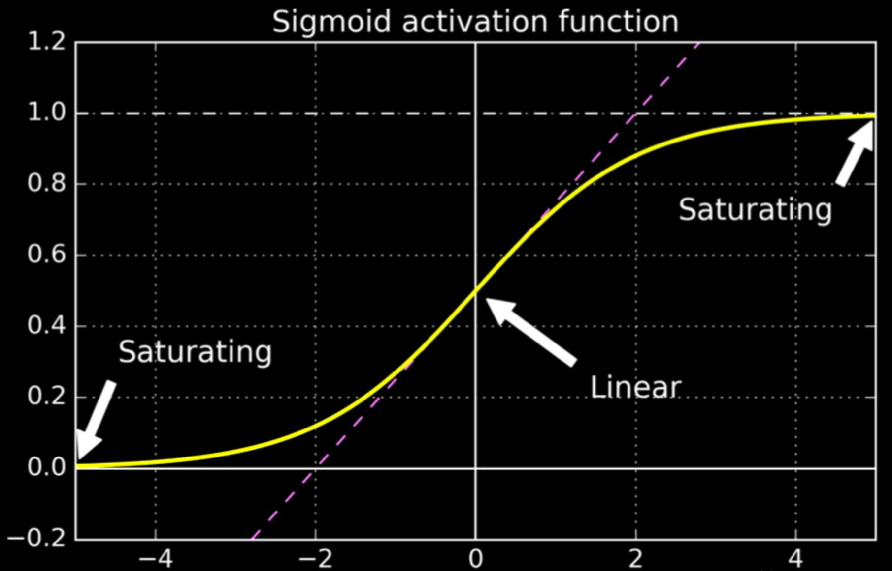

# 机器学习八股文

## Machine Leaning

### ML 基础概念

1. Overfitting / Underfitting  

   **过拟合**指模型与数据的匹配程度过高，将训练数据一些正常的起伏、波动、异常值也当作是数据的特征，导致模型对新数据的泛化能力变差。具体的表现为在训练集上表现非常优秀，而在验证集/测试集中表现非常差。
    - 解决过拟合的方法一般有：1) 适量减少特征的数量；2) 添加**正则化项**(Regularization)。正则化，顾名思义，目的是为了降低特征对于预测结果的影响能力。常见的正则化项有L1正则项和L2正则项。详见正则化。
    
    **欠拟合**与过拟合相反，指的是模型缺乏足够的泛化能力。
    - 解决欠拟合的方法有：1) 增加训练轮数；2) 增加模型特征；3) 减少正则项。

2. Bias / Variance trade-off

    偏差(Bias)指模型预测结果与真实值的差异程度，描述了模型的拟合能力；方差(Varience)指模型面对不同数据集时的差异程度，描述了数据扰动对模型的影响。
    一般来说，越简单模型的偏差越高，方差越低；越复杂模型的偏差越低，方差越高。这同样也对应着模型的过拟合与欠拟合。

    权衡偏差与方差的常见方法有**交叉认证**(Cross-Validation)。K折交叉验证的基本方法为：将训练集平均分为$k$份，每次训练取其中一份作为验证集，剩下$k-1$份作为训练集，重复$k$次，直到每一份小数据集都被作为过验证集。最终的损失为$k$次训练的损失取平均。

### 正则化 Regularization

1. L1 vs L2

    - L1正则化，又称LASSO、L1范数，是所有参数的绝对值之和。
        $$
            \lVert x \lVert_1=\sum_{i=1}^m\lvert x_i \lvert
        $$
    
    - L2正则化，又称Ridge，岭回归，是所有参数的平方和的平方根。

        $$
            \lVert x \lVert_2=\sqrt{\sum_{i=1}^m x_i^2}
        $$

    - 两种范数都有助于降低过拟合风险。L1范数可以用于**特征选择**，但不能直接求导，因此不能使用常规的梯度下降法/牛顿法等进行优化（常见方法有坐标轴下降法和 Lasso 回归法）；L2范数方便求导。

2. L1范数的稀疏性 / 为何L1正则化可以用于特征选择？

    L1范数相比于L2范数，更容易得到**稀疏解**，即L1范数可以将不重要的特征参数优化至**0**.

    - 如何理解？
    > 假设损失函数 $L$ 与某个参数 $x$ 的关系如下图所示：此时最优点位于绿色点处，$x<0$.
    > 
    > 
    >
    > 这时施加 L2 正则化，新的损失函数 $(L+Cx^2)$ 如下图蓝线所示，可以看到最优的 $x$ 在黄点处，$x$ 的绝对值减小了，但依然非零。
    >
    > 
    >
    > 而如果施加 L1 正则化，则新的损失函数 $(L+C\lvert x \lvert)$ 如下图粉线所示，最优的 $x$ 就变成了 0。
    >
    > 
    >
    > 略加推导可以得到，当施加 L2 正则化时，当且仅当损失函数原本的导数为 0 时，损失函数才会在 $x=0$ 处极小；而施加 L1 正则化时，参数 $C$ 与损失函数的导数仅需满足 $C>\lvert L \lvert$ 的关系，$x=0$ 便会成为损失函数的一个极小值点。 
    >
    > 上面只分析了一个参数 $x$。事实上 L1 正则化会使得许多参数的最优值变成 0，使得模型变得稀疏。利用这样的特性，我们便可以使用L1正则化来帮助筛选特征。

### 机器学习中的评估指标 Metrics

1. Precision / Recall / $F_1$ Score

    对于二分类问题，我们常常使用精确率(Precision)、召回率(Recall)以及$F_1$ Score来评估二分类模型的性能。对于一个二分类器，在数据集上的预测情况可以分为以下4种：

    - TP(True Positive)，将正类**正确**预测为正类；
    - TN(True Negative)，将负类**正确**预测为负类；
    - FP(False Positive)，将负类**错误**预测为正类；
    - FN(False Negative)，将正类**错误**预测为负类；
    
    有了以上概念，我们可以给出以下评估指标的定义：

    - 精确率定义为：
        $$
            P=\frac{TP}{TP+FP}
        $$
        即在模型**预测为正类**的样本中，预测正确的比例。可以看到，精确率更加关注于模型认为是正类样本的结果。
    - 召回率定义为：
        $$
            R=\frac{TP}{TP+FN}
        $$
        即在正类的样本中，模型预测正确的比例。相比之下，召回率更加关注于那些**真实值为正类**的样本。
    - 此外，$F_1$ 值定义为精确率与召回率的调和均值，即
        $$
            \frac{2}{F_1}=\frac{1}{P}+\frac{1}{R}
        $$
        $$
            F_1 = \frac{2 \times P \times R}{P + R} = \frac{2TP}{2TP+FP+FN}
        $$
        当精确率和召回率都高时，$F_1$ 值也会高。

2. 混淆矩阵 Confusion Matrix

    分类结果的混淆矩阵如下表所示。

    

3. macro-$F_1$ vs micro-$F_1$

    很多时候我们有多个二分类混淆矩阵（例如多次训练与测试 / 多个数据集 / 多分类任务中每两两类别的组合等），这是我们希望在 $n$ 个二分类混淆矩阵上综合考察模型性能。

    - macro-$F_1$

        一种直接的做法是直接计算各个混淆矩阵的精确率和召回率，再计算平均值，分别得到 macro-$P$、macro-$R$和对应的macro-$F_1$. 
        $$
            \text{macro-}P = \frac{1}{n}\sum_{i=1}^n P_i, \qquad
            \text{macro-}R = \frac{1}{n}\sum_{i=1}^n R_i,
        $$
        $$
            \text{macro-}F_1 = \frac{2 \times \text{macro-}P \times \text{macro-}R}{\text{macro-}P + \text{macro-}R}
        $$
    
    - micro-$F_1$

        另一种做法是先将各个混淆矩阵的对应元素进行平均，得到$\overline{TP}$、$\overline{TN}$、$\overline{FP}$和$\overline{FN}$，再基于这些值计算出micro-$P$、micro-$R$和对应的micro-$F_1$. 
        $$
            \text{micro-}P = \frac{\overline{TP}}{\overline{TP}+\overline{FP}}, \qquad
            \text{micro-}R = \frac{\overline{TP}}{\overline{TP}+\overline{FN}},
        $$
        $$
            \text{micro-}F_1 = \frac{2 \times \text{micro-}P \times \text{micro-}R}{\text{micro-}P + \text{micro-}R}
        $$

4. ROC 曲线 / AUC 面积

    ROC 曲线(Receiver Operating Characteristic)与 AUC (Area Under ROC Curve)是面对**不平衡分类问题**时最常用的评估指标。要了解 ROC 是什么，首先我们根据混淆矩阵再定义两个指标：True Positive Rate(TPR) 以及 False Positive Rate(FPR). 

    $$
        TPR = R = \frac{TP}{TP+FN}, \qquad
        FPR = \frac{FP}{TN+FP},
    $$
    正常来说，一个好的模型应该满足高 TPR 和低 FPR。对于任意一个训练好的模型，在给定测试数据上我们都能计算出它的 TPR 和 FPR。以 FPR 为横坐标，TPR 为纵坐标，我们可以将任意模型的一对 (FPR, TPR) 画在该坐标图中，如下图所示。同时我们将由该坐标轴构成的空间称为 ROC 空间。图1中假设有 A、B、C、D、E 共计五个模型。在 ROC 空间中，模型越靠近左上角，表明模型效果越好。

    

    在二分类问题的大多数情况中（尤其是神经网络中），我们判定一个样本是正类和负类的依据是设置一个阈值，超过该阈值的样本被标记为正类，反之则为负类。一般而言，这个阈值被设置为0.5。那么如果我们尝试使用不同的阈值来划分正负类，我们就能得到多组 (FPR, TPR)。我们可以根据这些坐标近似地在 ROC 空间中画出一条曲线，即 **ROC 曲线**。只要 (FPR, TPR) 点足够多，我们可以计算出曲线下的面积，即 **AUC面积**，如下图所示。

    

### Loss与优化

1. 凸优化问题

    对于一个优化问题，如果其目标函数是**凸函数**，且可行域是**凸集**（集合中任意两点连线上的任意点都在集合内），那么它就是一个凸优化问题。
    
    定义域 $\mathbb{D}$ 是一个凸集的函数 $f$ 是凸函数，当且仅当对于任意的 $x,y \in \mathbb{D}$ 和 $\theta \in [0,1]$，都有：

    $$
        f(\theta x+(1-\theta)y) \le \theta f(x)+(1-\theta) f(y)
    $$

    

    数学中强调凸优化问题的重要性，在于凸优化问题的**局部最优解**必然也是其**全局最优解**。这个特性使得我们可以使用贪心算法、梯度下降法、牛顿法等方法来求解凸优化问题。事实上，我们求解许多非凸优化问题，也是通过将其拆解为若干个凸优化问题，再分别进行求解。

2. MSE / MSELoss

    均方误差 (Mean Square Error, MSE)，是回归任务中最常见的度量指标。

    $$
        E(f;D)=\sum_{i=1}^m (f(x_i) - y_i)^2
    $$

3. 以 MSELoss 为损失函数的逻辑回归是凸优化问题吗？

    **不是**。逻辑回归将线性模型通过 sigmoid 非线性函数映射为分类问题，其 MSE 是一个非凸函数，优化时可能得到局部最优解而得不到全局最优解，所以以 MSELoss 为损失函数的逻辑回归不是凸优化问题。

4. 线性回归，最小二乘法与最大似然估计的关系？

    求解线性回归常用的方法有**最小二乘法 (OLS)**和**最大似然估计 (MLE)**。

    - 最小二乘法以预测值和真实值的平方和作为损失函数 (MSELoss)。

        $$
            J(w)=\sum_{i=1}^m (h_w(x_i) - y_i)^2
        $$

    - 最大似然估计在已知 $x$ 与 $y$ 的情况下，以**概率最大**的角度，估计模型可能性最大的参数 $h_w$。设误差 $\epsilon_i = y_i - h_w(x_i)$， 由于 $\epsilon_i$ 符合高斯分布，可得概率密度函数：
        
        $$
            p(\epsilon_i) = \frac{1}{\sigma \sqrt{2\pi}} e^{-\frac{(\epsilon_i)^2}{2\sigma^2}}
        $$

        将 $\epsilon_i = y_i - h_w(x_i)$ 代入，可得：

        $$
            p(y_i | h_w(x_i)) = \frac{1}{\sigma \sqrt{2\pi}} e^{-\frac{(y_i - h_w(x_i))^2}{2\sigma^2}}
        $$

        则似然函数公式如下：

        $$
            \begin{aligned}
                L(h_w(x_i)) &= \prod_{i=1}^m p(y_i | h_w(x_i))\\
                &= \prod_{i=1}^m \frac{1}{\sigma \sqrt{2\pi}} e^{-\frac{(y_i - h_w(x_i))^2}{2\sigma^2}} \\
            \end{aligned}
        $$

        等号两边取对数，不影响函数的极值点。

        $$
            \begin{aligned}
                \log L(h_w(x_i)) &= \sum_{i=1}^m \log \frac{1}{\sigma \sqrt{2\pi}} e^{-\frac{(y_i - h_w(x_i))^2}{2\sigma^2}}\\
                &= m \log \frac{1}{\sigma \sqrt{2\pi}} - \frac{1}{2\sigma^2} \sum_{i=1}^m (y_i - h_w(x_i))^2
            \end{aligned}
        $$

        我们知道 $h_w(x)$ 是关于权重 $w$ 的函数，不妨设为 $l(w)$。因此有：
            
        $$
            \begin{aligned}
                l(w) = m \log \frac{1}{\sigma \sqrt{2\pi}} - \frac{1}{2\sigma^2} \sum_{i=1}^m (y_i - h_w(x_i))^2
            \end{aligned}
        $$

        去除前面的常数项和常数系数，可以看到与最小二乘法的的公式一致，之后求解过程同最小二乘法。因此得出结论，最小二乘法与最大似然估计从两个不同的角度出发，得到一致的结果。

5. 相对熵与交叉熵 Ralative-Entropy / Cross-Entropy

    我们常用**信息量**来量化数据中的信息。设事件 $x_0$ 发生的概率为 $p(x_0)$，则其信息量为：

    $$
        I(x_0) = -\log p(x_0)
    $$

    **熵** (Entropy) 被用来度量一个系统的混乱程度，代表一个系统中所有事件信息量的期望。熵越大，该系统的不确定性也越大。

    $$
        H(X) = -\sum_{x \in X}p(x_i) \log p(x_i)
    $$

    **相对熵** (Ralative Entropy)，又称 **KL 散度** (Kullback-Leibler Divergence)，是两个随机分布 $p$ 与 $q$ 之间的对数差值的期望。

    $$
        D_{KL}(p||q)=\sum_{x\in X} p(x)\log\frac{p(x)}{q(x)}=-\sum_{x\in X} p(x)[\log q(x) - \log p(x)]
    $$

    **交叉熵** (Cross-Entropy)，与 KL 散度类似，是两个随机分布 $p$ 与 $q$ 之间距离的另一种度量。

    $$
        CEH(p,q)=−\sum_{x \in X}p(x)logq(x)
    $$

    > **为何在机器学习中常使用交叉熵而不是 KL 散度作为损失函数？**
    >
    > 可以看到，相对熵、交叉熵之间存在以下关系：
    > 
    >    $$
    >       D_{KL}(p||q) = CEH(p,q) - H(p)
    >    $$
    >    
    > 在机器学习中，可以将 $p$ 看作真实分布，$q$ 为预测分布。则当 $p$ 的分布已知时，$H(p)$ 为常数，交叉熵与 KL 散度等价。

### Naive Bayes 朴素贝叶斯

1. 概率相关公式及贝叶斯定理

    - 条件概率：事件 A 在另外一个事件 B 已经发生条件下的发生概率，即 $p(A|B)$；
    - 联合概率：事件 A 和事件 B 同时发生的概率，即 $p(A, B) = p(A|B) * p(B)$；
    - 全概率：若事件 B1, B2, ..., Bn 构成一个**完备事件组**，即他们两两不相容，且和为全集，则对于任意事件 A 有： $p(A)=\sum^n_{i=1} [p(A|B_i)*p(B_i)]$
    - 贝叶斯概率：在日常生活中，有时候我们难以直接求出 $p(A_i|B)$，但我们若已知 $p(B|A_i)$，$p(A_i)$ 和 $p(B)$，则有：
        $$
            p(A_i|B) = \frac{p(B|A_i)*p(A_i)}{p(B)} = \frac{p(B|A_i)*p(A_i)}{\sum^n_{j=1}p(B|A_j)*p(A_j)}
        $$
        其中，$p(A_i|B)$ 被称为**后验概率**，$p(A_i)$ 被称为**先验概率**。

2. 朴素贝叶斯分类器

    - 设 $x=\{a_1,a_2,...,a_m\}$ 为一个待分类项，其中 $a_i$ 是 $x$ 的特征属性。
    - 有类别集合 $C=\{y_1,y_2,...,y_n\}$。
    - 对每一个类别 $y_i$，统计各个特征属性的条件概率，即 $p(a_1|y_1)$, $p(a_2|y_1)$, ..., $p(a_m|y_1)$。
    - 根据贝叶斯公式，求得 $p(y_i|x)=\frac{p(x|y_i)*p(y_i)}{p(x)}$。
    - 计算所有类别的 $p(y_i|x)$，概率最大的 $y_k$ 即为预测的类别。
    - 该分类器之所以被称为“朴素”贝叶斯，是因为模型假设待分类项 $x$ 的所有特征都是**独立的**事件。
    - 常见的朴素贝叶斯分类器有：
        - GaussianNB，该分类器用**高斯分布**来假设类别的先验概率分布，一般用于连续型数据。
        - MultinomialNB，该分类器用**多项式分布**来假设类别的先验概率分布，用于多项式数据。
        - BernoulliNB，该分类器用**伯努利分布**来假设类别的先验概率分布，用于二项分布数据。

3. 朴素贝叶斯分类器的优缺点

    朴素贝叶斯分类器的主要优点有：
    - 模型发源于古典数学概论，算法比较简单，且有稳定的分类效率；
    - 对小规模的数据表现好，适合多分类任务；
    - 对缺失数据不敏感，例如文本分类等任务；
    - 不存在过拟合的说法。

    朴素贝叶斯分类器的缺点有：
    - 朴素贝叶斯假设特征之间相互独立，但在现实中这个假设往往不成立；
    - 朴素贝叶斯需要先估计先验概率，如果估计不准确容易影响分类结果；
    - 基于概率的分类有可能会不准确。

4. Generative Model vs Discriminative Model 生成模型 / 判别模型

    生成模型通过学习联合概率，即特征 $x$ 与类别 $y$ 同时出现的概率，再对每一个类别求条件概率，取概率最大的类别作为预测结果。
     - 生成模型能学习到更多信息，如每个特征的边缘分布 $p(x)$；
     - 生成模型收敛速度快，且对小规模数据或稀疏数据表现较好；
     - 生成模型不容易出现过拟合现象；
     - 生成模型的效果一般没有判别模型好。
    
    判别模型则是通过学习条件概率，即直接预测特征 $x$ 下类别 $y$ 的概率。
     - 判别模型的分类边界更加灵活，能够拟合更加复杂的边界；
     - 只用学习分类的信息，问题得到简化；
     - 准确率普遍较生成模型较高。

## Deep Learning

### DL 基础概念

1. 为什么神经网络需要偏置项？

    对于神经网络中的每一个神经元，都有 $y_i = W^TX_i + b$。这个式子本质上就是要用这个函数在空间中划分决策面。而如果没有偏置项，那么划分的超平面就只能经过原点。偏置项的加入使得神经网络的拟合更加灵活，如果没有偏置项，训练可能难以收敛或出现其他 bug。

    > **在所有场合都可以使用偏置项吗？**
    > 
    > 不是。例如在卷积层之后，如果要添加 Batch Normalization 层，最好不添加偏置项，因为不起作用，且会占用显卡内存。
    > 
    > 在 BN 中，有一步关键操作为：
    > 
    > $$
    >       \hat{x_i} = \frac{x_i - \mu_\mathcal{B}}{\sqrt{\sigma^2_{\mathcal{B}} + \epsilon}}
    > $$
    > 
    > 其中，$\mu_\mathcal{B}$ 为均值，$\sigma^2_{\mathcal{B}}$ 为方差。在该操作中，偏置项在计算中会被抵消掉，故偏置项不起作用。

2. Back Propagation

    BP 神经网络是由一个输入层、一个输出层和若干个隐藏层构成的。输入信号从输入层进入，经过隐藏层计算，并由输出层输出。将输出的结果和真实值进行比对得到训练的误差。该误差沿着输出层，经过隐藏层，最终传播到输入层的权值参数。由于误差传播方向和训练方向相反，故称“反向传播”。

    反向传播是为了解决神经网络无法直接应用梯度下降法的问题。由于梯度下降法只能用于“能够通过得到误差”的情况，例如逻辑回归。但隐藏层并不存在所谓“误差”，因此只能通过先将误差反向传播到隐藏层，应用链式法则得到求导函数，再使用梯度下降法进行优化。反向传播算法可以看作是梯度下降法在链式法则（Chain Rule）中的应用。

3. 梯度消失和梯度爆炸问题

    在反向传播的梯度更新中，若更新的梯度一直小于 0，就可能触发连乘效应，在之后的传播中越传越小，导致靠近输入层的权值几乎不更新，训练收敛速度变慢，这便是**梯度消失**。与之相反，若梯度过大则会触发**梯度爆炸**，以致于溢出，出现梯度为 NaN 的问题。
    
    > 当激活函数为 Sigmoid 时，容易触发梯度消失问题。因为 Sigmoid 函数的导数最大值只有 0.25，如图所示。
    > 
    > 

    常见的缓解梯度消失 / 梯度爆炸的方法有：
    - 使用其他**激活函数**，如ReLU等；
    - 用更合理的**权值初始化**方式，如 Xavier 初始化，He 初始化。这两种初始化方法都能保证在传播时权值的方差不变。
    - **Batch Normalization**. 梯度的更新与 $x$ 的值也有关系，因此用 BN 限制 $x$ 的分布也有利于缓解梯度消失 / 梯度爆炸问题；
    - 对权重进行**正则化**（L1、L2）；
    - 使用 **ResNet 网络**。ResNet 通过添加 Shortcut Connections，使得层与层之间可以跨层连接，减少了梯度消失 / 梯度爆炸的问题。
    - 通过**梯度截断**（Gradient Truncation）手动防止梯度爆炸。

4. 能不能将神经网络的所有权值都初始化为 0？

    不能。事实上，不能将神经网络的所有权值都设置为同一值。否则，在神经网络的更新中，两权值的更新将一模一样。多个相同的神经元相当于只有一个神经元，会使得神经网络无法拟合。

    因此，一般我们选择随机初始化，或是使用其他初始化方法，如 Xavier 初始化，He 初始化。这两种初始化方法都能保证在传播时权值的方差不变。

5. 在深度学习中缓解过拟合问题

    深度学习中防止过拟合常见的方法有：

    - 获取更多、质量更高的数据
      - 采集新的数据
      - 数据增强（图片镜像、翻转等）
      - 利用对抗网络生成数据
    - 正则化（L1、L2）
    - Dropout
    - Early Stopping
    - 集成学习，如 Bagging、Boosting 等。

6. Dropout 是什么？

    Dropout 是在每次训练过程中都随机舍弃一些神经元之间的连接。这样做可以降低对部分上层神经元的依赖关系，迫使模型去学习一些更具有鲁棒性的特征，使得模型泛化能力更强。

    
    

7. Dropout 和 Batch Normalization 在训练和预测中的区别？

    Dropout 在训练时采用，是为了减少神经元对部分上层神经元的依赖，减少过拟合的风险。而在预测中，应该用训练完成的模型，不需要 Dropout。

    对于 BN，在训练时使用每一批数据的均值和方差进行计算，对每一批数据单独进行归一化。但在测试时，可能不存在 batch 的概念（例如预测单条数据）。因此在测试时，一般使用所有训练数据的均值和方差进行计算。

    > **为什么不在训练的时候使用所有训练数据的均值和方差？**
    > 
    > 因为在训练中使用所有数据的均值和方差容易出现过拟合现象。
    > 
    > BN 的原理就是将每一批数据都归一到相同的分布。而每一批数据的均值和方差都不相同，这个差别能够增加模型的鲁棒性，在一定程度上减少模型的过拟合现象。
    > 
    > 也正是因此，当应用 BN 时，一般要求将训练集完全打乱，并用一个较大的 batch size，否则，一批数据可能无法较好得代表训练集的分布，会影响模型训练的效果。

8. 常见的 Non-Linear Activation Function 及其优缺点

    非线性激活函数是神经网络与感知机网络最大的区别，即将非线性特性引入到网络中。如果不用非线性激活函数，则每一层都是上一层的线性变换，无论网络有多少层，输出都是输入的线性组合。而加入非线性层后，神经网络便拥有了学习非线性关系的能力，这使得神经网络可以逼近任意形状的函数。

   | 函数名 |         函数表达式        |        优点           |      缺点         |
   |:-----:|:-----------------------:|:----------------------|:-----------------|
   |Sigmoid|$\displaystyle f(z)=\frac{1}{1+e^{-z}}$|1. 将输入转换为 (0, 1) 的区间。|1. 在神经网络反向传播中可能出现梯度消失问题； 2. 函数均值不为 0，使得权值总往同一方向更新， 收敛速度慢。|
   |  tanh |$\displaystyle f(z)=\frac{e^z-e^{-z}}{e^z+e^{-z}}$|1. 将输入转换为 (0, 1) 的区间； 2. 解决 Sigmoid 均值非 0 问题。|1. 依然存在梯度消失问题； 2. 幂函数计算复杂，训练时间大。|
   |  ReLU |$f(z)=max(0,x)$|1. 解决了梯度消失的问题； 2. 计算与收敛速度快。|1. 函数均值不为 0； 2. Dead ReLU Problem. 当 $x<0$ 时梯度为 0，且 该神经元之后的神经元梯度永远为 0，即神经元直接 失效。通过合理的初始化，或是降低学习率来解决。|
   |Leaky ReLU|$f(z)=max(\alpha \cdot x,x)$|1. 使得神经元在负数区域偏向于 激活而不是直接失效。|1. 函数均值不为 0； 2. $\alpha$ 的值需要确定且比较敏感（通常是一个非常小 的值，如 0.01）。

9. Gradient Descent vs Stochastic Gradient Descent vs Mini-Batch Gradient Descent

    |        方法     |                 优点           |            缺点               |
    |:--------------:|:------------------------------|:------------------------------|
    |Gradient Descent|1. 参数梯度更新方向大致确定； 2. 适合并行化计算。|1. 训练时收敛速度慢； 2. 当数据量大时，需要大量显存。|
    |Stochastic Gradient  Descent (SGD)|1. 每次只随机抽取一条数据进行梯度更新， 花费代价小； 2. 适合大量数据的训练。|1. 需要更多迭代次数； 2. 参数更新的过程震荡很大，参数更新方向有很大的波动； 3. 不适合并行化计算。|
    |Mini-Batch Gradient  Descent (MBGD)|结合了前两种方法的优势： 1. 比 GD 收敛速度快，比 SGD 更加稳定； 2. 能利用高度优化的矩阵运算，适合并行化；|1. 难以选择合适的学习率。太小的学习率会导致收敛缓慢； 太大的学习率会导致波动过大，可能跳出局部最优解。 可以采用动态调整学习率的方法（learning rate decay）。

10. 常见的优化器及其对比

    |        方法     |                 特点                                          |
    |:--------------:|:--------------------------------------------------------------|
    |GD / SGD / MBGD|1. 难以选择合适的学习率。学习率太小会导致收敛缓慢；学习率太大会导致波动过大，可能跳出局部最优解。 2. 每个参数的学习率都是相同的。如果数据是稀疏的，且不同特征的出现频率相差较大，则会出现部分特征 学习不足的问题； 3. 在训练中容易陷入鞍点，即局部最优点，在这些点的梯度为 0，无法继续训练。|
    | Momentum      |1. 借鉴了物理中的动量概念，模拟物体运动时的惯性，即更新的时候在一定程度上保留之前更新的方向，而不 是像 GD 算法一样完全按照新的梯度方向更新。这样可以增加稳定性，并且有一定的摆脱局部最优解的能力。 2. Momentum 算法会观察上一步的梯度，若当前梯度方向与历史梯度一致，则增强该方向的梯度，否则则削 弱该方向的梯度。|
    |    AdaGrad    |1. 针对 GD 算法中对于每个参数都保持同一学习率的问题，AdaGrad 算法能在训练中自动对不同参数的学习率 进行调整。对于出现频率比较低的特征，加大更新的学习率；对于出现频率高的，减小学习率。 2. 由于这个特性，AdaGrad 非常适合用于处理稀疏的数据。|
    |    RMSprop    |1. Root Mean Square prop. 对 AdaGrad 算法的改进，把 AdaGrad 的将历史梯度相加变成对历史梯度求均值； 2. 这种方法可以缓解 AdaGrad 算法学习率下降较快的问题。|
    |     Adam      |1. Adam 算法结合了 AdaGrad 和 RMSprop 的优点，即动态更新参数的学习率。不同于 RMSprop 只参考了参 数的历史平均值，Adam 同时参考了梯度的平均值和方差。 2. 在各大机器学习库中，两次估计的衰减率默认值 $\beta_1$ 和 $\beta_2$ 分别为 0.9 和 0.999.|
    |    AdamW      |1. 针对 Adam 算法中先进行梯度衰减再进行正则化，使得梯度大的参数无法正常被正则化的问题，在 AdamW 中将梯度衰减的步骤移到正则化后，解决了这一问题。

11. 如何正确使用迁移学习？

    通过使用之前在大数据集上经过训练的预训练模型，我们可以直接使用相应的结构和权重，将它们应用到我们正在面对的问题上。

    - 场景一：现有数据集***大***，数据与原数据相似度***高***

        这是最理想的情况，采用预训练模型会变得非常高效。最好的运用方式是保持模型原有的结构和初始权重不变，随后在新数据集的基础上重新训练 / 微调。

    - 场景二：现有数据集***小***，数据与原数据集相似度***高***
        
        在这种情况下，由于数据和原数据集相似度高，我们不需要重新训练模型，只需要将输出层改为新问题的结构即可。

    - 场景三：现有数据集***大***，数据与原数据集相似度***低***

        因为实际数据与预训练模型的训练数据之间存在很大差异，采用预训练模型将不会是一种高效的方式。因此最好的方法还是只沿用预训练模型的结构。将预处理模型中的权重全都初始化后，在新数据集上**重新**开始训练。

    - 场景四：现有数据集***小***，数据与原数据集相似度***低***

        这是最糟糕的一种情况。为了防止过拟合，我们不能从头开始训练。我们可以利用预训练模型较低的层进行特征提取，弥补数据集大小不足的缺陷，再利用较高的层进行训练（一般而言，神经网络较高的层具有较高的区分度，更适合用来训练数据本身）。因此，我们**冻结**预训练模型前 $k$ 层的权重，用于提取数据的特征，然后训练后 $n-k$ 层，并将原输出层改为新问题的结构。

## Natural Language Processing

### RNN / LSTM

1. 为什么需要 RNN？

    循环神经网络（Recurrent Neural Network, RNN）。当给定的数据是序列型数据，如文本、音频等数据时，我们往往希望模型能够学习到给定数据的上下文环境。例如，对于一个句子，序列模型试图从同一个句子前面的单词推导出关系。

    

    在循环神经网络的每一个时间步骤（time step）中，我们取一个输入 $x_i$ 和上一个节点的权值 $h_{i-1}$ 作为输入，并产生一个输出 $y_i$ 和权值 $h_i$，这个权值又被传递到下一个时间步骤，直到输入序列被读取完毕。

    

    普通的 RNN（Vanilla RNN）常使用 BP 算法来训练权值，但由于**梯度消失 / 梯度爆炸**问题，RNN 会丧失学习远距离信息的能力。为了解决远距离依赖问题，提出了 LSTM（Long Short-Term Memory）。

2. LSTM 网络

    LSTM（Long Short-Term Memory）相对于普通 RNN 网络，能够显著的缓解长期依赖关系丢失的问题。LSTM 的主要思想是利用**门结构**来去除或添加细胞之间信息传递的能力。LSTM 拥有三个门，来保护和控制细胞状态，分别为**遗忘门**、**输入门**和**输出门**。

    - 遗忘门

        
        第一步是决定从上一个细胞中保留多少消息。将上一细胞的状态 $h_{t-1}$ 和这一层的输入 $x_i$ 经过 sigmoid 层，输出一个 0-1 的值，代表要从上一层的细胞状态保留多少信息。

    - 输入门

        
        这一步是决定在这一层的细胞状态中保留多少信息。将上一细胞的状态 $h_{t-1}$ 和这一层的输入 $x_i$ 分别经过 sigmoid 层和 tanh 层，得到一个候选的细胞状态 $\tilde{C}_t$。

        
        随后，根据遗忘门得到的遗忘比例 $f_t$ 和这一层要输入的细胞状态 $\tilde{C}_t$，得到这一层的最终细胞状态 $C_t = f_t*C_{t-1} + i_t*\tilde{C}_t$。

    - 输出门

        
        最终，我们需要决定这一层的细胞的输出状态。将上一细胞的状态 $h_{t-1}$ 和这一层的输入 $x_i$ 经过 sigmoid 层，确定要输出的部分 $o_t$，再将这一层的细胞状态 $C_t$ 经过 tanh 层，再与 $o_t$ 结合，得到最终的输出状态 $h_t$。

