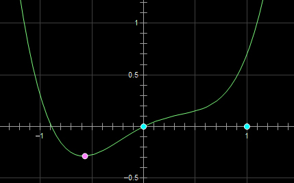

# 机器学习八股文

## Machine Leaning基础概念

1. Overfitting / Underfitting  

   **过拟合**指模型与数据的匹配程度过高，将训练数据一些正常的起伏、波动、异常值也当作是数据的特征，导致模型对新数据的泛化能力变差。具体的表现为在训练集上表现非常优秀，而在验证集/测试集中表现非常差。
    - 解决过拟合的方法一般有：1) 适量减少特征的数量；2) 添加**正则化项**(Regularization)。正则化，顾名思义，目的是为了降低特征对于预测结果的影响能力。常见的正则化项有L1正则项和L2正则项。详见正则化。
    
    **欠拟合**与过拟合相反，指的是模型缺乏足够的泛化能力。
    - 解决欠拟合的方法有：1) 增加训练轮数；2) 增加模型特征；3) 减少正则项。

2. Bias / Variance trade-off

    偏差(Bias)指模型预测结果与真实值的差异程度，描述了模型的拟合能力；方差(Varience)指模型面对不同数据集时的差异程度，描述了数据扰动对模型的影响。
    一般来说，越简单模型的偏差越高，方差越低；越复杂模型的偏差越低，方差越高。这同样也对应着模型的过拟合与欠拟合。

    权衡偏差与方差的常见方法有**交叉认证**(Cross-Validation)。K折交叉验证的基本方法为：将训练集平均分为$k$份，每次训练取其中一份作为验证集，剩下$k-1$份作为训练集，重复$k$次，直到每一份小数据集都被作为过验证集。最终的损失为$k$次训练的损失取平均。

## 正则化 Regularization

1. L1 vs L2

    - L1正则化，又称LASSO、L1范数，是所有参数的绝对值之和。
        $$
            \lVert x \lVert_1=\sum_{i=1}^m\lvert x_i \lvert
        $$
    
    - L2正则化，又称Ridge，岭回归，是所有参数的平方和的平方根。

        $$
            \lVert x \lVert_2=\sqrt{\sum_{i=1}^m x_i^2}
        $$

    - 两种范数都有助于降低过拟合风险。L1范数可以用于**特征选择**，但不能直接求导，因此不能使用常规的梯度下降法/牛顿法等方法进行学习；L2范数方便求导。

2. L1范数的稀疏性 / 为何L1正则化可以用于特征选择？

    L1范数相比于L2范数，更容易得到**稀疏解**，即L1范数可以将不重要的特征参数优化至**0**.

    - 如何理解？
    > 假设损失函数 $L$ 与某个参数 $x$ 的关系如下图所示：此时最优点位于绿色点处，$x<0$.
    > 
    > 
    >
    > 这时施加 L2 正则化，新的损失函数 $(L+Cx^2)$ 如下图蓝线所示，可以看到最优的 $x$ 在黄点处，$x$ 的绝对值减小了，但依然非零。
    >
    > 
    >
    > 而如果施加 L1 正则化，则新的损失函数 $(L+C\lvert x \lvert)$ 如下图粉线所示，最优的 $x$ 就变成了 0。
    >
    > 
    >
    > 略加推导可以得到，当施加 L2 正则化时，当且仅当损失函数原本的导数为 0 时，损失函数才会在 $x=0$ 处极小；而施加 L1 正则化时，参数 $C$ 与损失函数的导数仅需满足 $C>\lvert L \lvert$ 的关系，$x=0$ 便会成为损失函数的一个极小值点。 
    >
    > 上面只分析了一个参数 $x$。事实上 L1 正则化会使得许多参数的最优值变成 0，使得模型变得稀疏。利用这样的特性，我们便可以使用L1正则化来帮助筛选特征。

## 机器学习中的评估指标 Metrics

1. Precision / Recall / $F_1$ Score

    对于二分类问题，我们常常使用精确率(Precision)、召回率(Recall)以及$F_1$ Score来评估二分类模型的性能。对于一个二分类器，在数据集上的预测情况可以分为以下4种：

    - TP(True Positive)，将正类**正确**预测为正类；
    - TN(True Negative)，将负类**正确**预测为负类；
    - FP(False Positive)，将负类**错误**预测为正类；
    - FN(False Negative)，将正类**错误**预测为负类；
    
    有了以上概念，我们可以给出以下评估指标的定义：

    - 精确率定义为：
        $$
            P=\frac{TP}{TP+FP}
        $$
        即在模型**预测为正类**的样本中，预测正确的比例。可以看到，精确率更加关注于模型认为是正类样本的结果。
    - 召回率定义为：
        $$
            R=\frac{TP}{TP+FN}
        $$
        即在正类的样本中，模型预测正确的比例。相比之下，召回率更加关注于那些**真实值为正类**的样本。
    - 此外，$F_1$ 值定义为精确率与召回率的调和均值，即
        $$
            \frac{2}{F_1}=\frac{1}{P}+\frac{1}{R}
        $$
        $$
            F_1 = \frac{2 \times P \times R}{P + R} = \frac{2TP}{2TP+FP+FN}
        $$
        当精确率和召回率都高时，$F_1$ 值也会高。

2. 混淆矩阵 Confusion Matrix

    分类结果的混淆矩阵如下表所示。
    

3. macro-$F_1$ vs micro-$F_1$

    很多时候我们有多个二分类混淆矩阵（例如多次训练与测试 / 多个数据集 / 多分类任务中每两两类别的组合等），这是我们希望在 $n$ 个二分类混淆矩阵上综合考察模型性能。

    - macro-$F_1$

        一种直接的做法是直接计算各个混淆矩阵的精确率和召回率，再计算平均值，分别得到 macro-$P$、macro-$R$和对应的macro-$F_1$. 
        $$
            \text{macro-}P = \frac{1}{n}\sum_{i=1}^n P_i, \qquad
            \text{macro-}R = \frac{1}{n}\sum_{i=1}^n R_i,
        $$
        $$
            \text{macro-}F_1 = \frac{2 \times \text{macro-}P \times \text{macro-}R}{\text{macro-}P + \text{macro-}R}
        $$
    
    - micro-$F_1$

        另一种做法是先将各个混淆矩阵的对应元素进行平均，得到$\overline{TP}$、$\overline{TN}$、$\overline{FP}$和$\overline{FN}$，再基于这些值计算出micro-$P$、micro-$R$和对应的micro-$F_1$. 
        $$
            \text{micro-}P = \frac{\overline{TP}}{\overline{TP}+\overline{FP}}, \qquad
            \text{micro-}R = \frac{\overline{TP}}{\overline{TP}+\overline{FN}},
        $$
        $$
            \text{micro-}F_1 = \frac{2 \times \text{micro-}P \times \text{micro-}R}{\text{micro-}P + \text{micro-}R}
        $$

4. ROC 曲线 / AUC 面积

    ROC 曲线(Receiver Operating Characteristic)与 AUC (Area Under ROC Curve)是面对**不平衡分类问题**时最常用的评估指标。要了解 ROC 是什么，首先我们根据混淆矩阵再定义两个指标：True Positive Rate(TPR) 以及 False Positive Rate(FPR). 

    $$
        TPR = R = \frac{TP}{TP+FN}, \qquad
        FPR = \frac{FP}{TN+FP},
    $$
    正常来说，一个好的模型应该满足高 TPR 和低 FPR。对于任意一个训练好的模型，在给定测试数据上我们都能计算出它的 TPR 和 FPR。以 FPR 为横坐标，TPR 为纵坐标，我们可以将任意模型的一对 (FPR, TPR) 画在该坐标图中，如下图所示。同时我们将由该坐标轴构成的空间称为 ROC 空间。图1中假设有 A、B、C、D、E 共计五个模型。在 ROC 空间中，模型越靠近左上角，表明模型效果越好。
    

    在二分类问题的大多数情况中（尤其是神经网络中），我们判定一个样本是正类和负类的依据是设置一个阈值，超过该阈值的样本被标记为正类，反之则为负类。一般而言，这个阈值被设置为0.5。那么如果我们尝试使用不同的阈值来划分正负类，我们就能得到多组 (FPR, TPR)。我们可以根据这些坐标近似地在 ROC 空间中画出一条曲线，即 **ROC 曲线**。只要 (FPR, TPR) 点足够多，我们可以计算出曲线下的面积，即 **AUC面积**，如下图所示。
    

